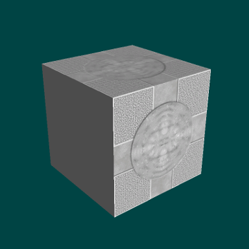

# RajawaliTollBridge

A proof of concept integration between 
the [Tiny wavefront obj loader](https://github.com/tinyobjloader/tinyobjloader) 
and the [Rajawali rendering engine](https://github.com/Rajawali/Rajawali)

Implements:
 - geometry triangulation
 - loading multiple materials per shape
 - ambient, diffuse and specular color loading
 - diffuse texture loading
 - bump and specular texture mapping
 - transparency (dissolve)



This project contains submodules, so one may wish to clone with the `--recurse-submodules` option, as in
```
git clone --recurse-submodules https://github.com/contriteobserver/RajawaliTollBridge.git
```
